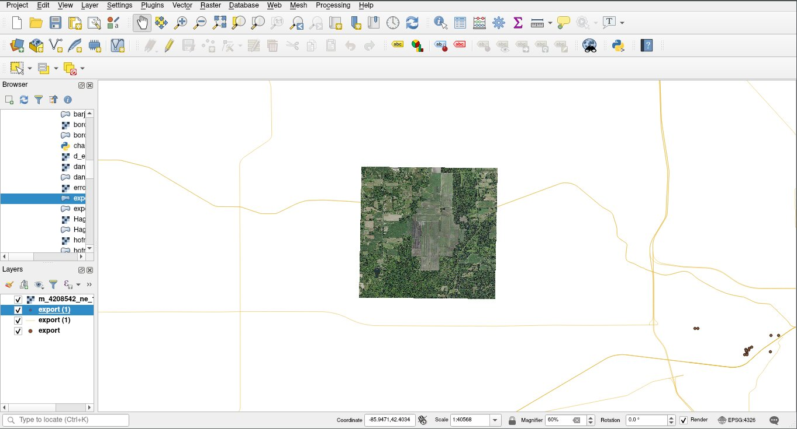

## CSE 620B - Remote Sensing and Computer Vision - QGIS Installation

### Installation

QGIS was installed on Arch Linux (w/i3wm) via the package manager, pacman.

### Data Sources

Raster data was downloaded via [USGS EarthExplorer](https://earthexplorer.usgs.gov/order/index/). Data focuses on the greater-Kalamazoo area of Michigan.

Vector data was downloaded via [OverpassTurbo](https://overpass-turbo.eu/#). Data lists features matching the keyword 'route', intending to capture the state routes in greater Kalamazoo.

### Visualization

Raster and vector data were visualized in QGIS. The vector data intentionally extends beyond the raster data, since the map area where raster and vector data overlap is difficult to discern raster vs vector data in the image.



### Markdown

Markdown is a lightweight and easy-to-use syntax for styling your writing. It includes conventions for

```markdown
Syntax highlighted code block

# Header 1
## Header 2
### Header 3

- Bulleted
- List

1. Numbered
2. List

**Bold** and _Italic_ and `Code` text

[Link](url) and 
```

For more details see [GitHub Flavored Markdown](https://guides.github.com/features/mastering-markdown/).

### Jekyll Themes

Your Pages site will use the layout and styles from the Jekyll theme you have selected in your [repository settings](https://github.com/nickhags/cse620b_qgis_install/settings). The name of this theme is saved in the Jekyll `_config.yml` configuration file.

### Support or Contact

Having trouble with Pages? Check out our [documentation](https://docs.github.com/categories/github-pages-basics/) or [contact support](https://github.com/contact) and we’ll help you sort it out.
